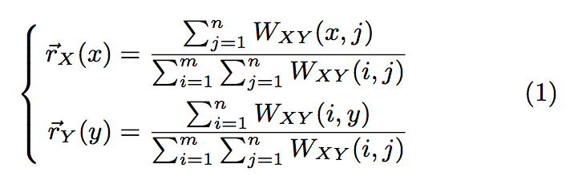
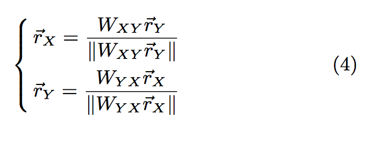
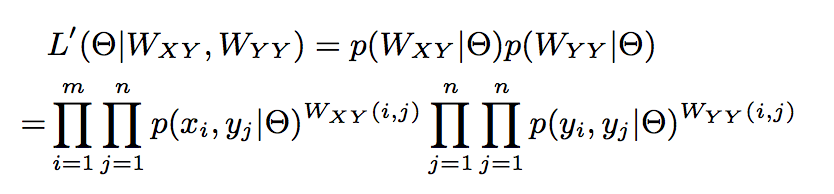
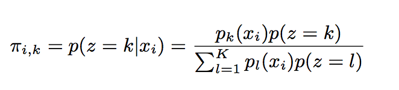
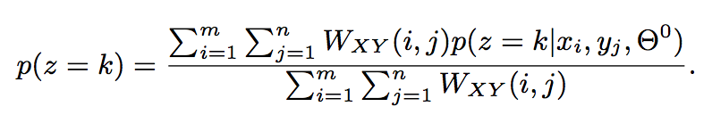
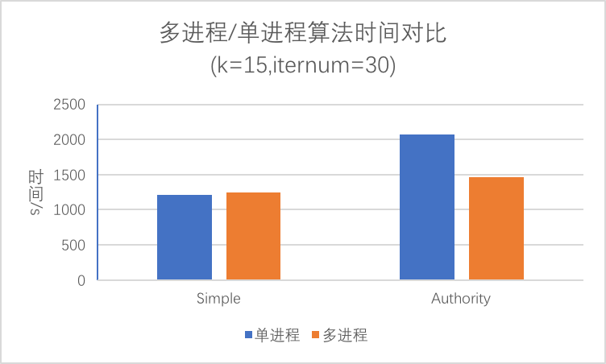
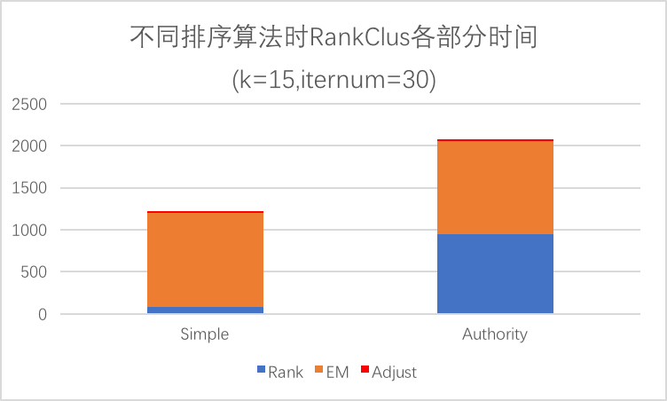
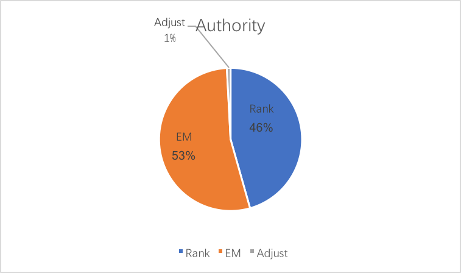

# 2018 PKU Data Warehouse

### 一、文件与编译使用说明

#### 1.1、数据文件

- **data**文件夹

包含了需要的xml数据以及提取后的文件（**dblp.xml** 在github中没有上传，请自行下载<a href = "http://dblp.org/xml/release/">dblp-2018-05-01</a>）

- **output**文件夹

存放了对作者、会议排名的（每个类别前十位）结果（CSV格式）

- **pic**文件夹

存放了README文件需要的图片

 

#### 1.2、代码文件

- **HandleXML.ipynb**

预处理xml文件，从中提取出信息

- **simple.ipynb** && **authority.ipynb**

分别用 SimpleRanking 和 AuthorityRanking 排序方法实现的RankClus算法。

- **multi_simple.ipynb** && **multi_authority.ipynb**

以上代码的多进程版本

 

#### 1.3、运行环境 && 运行方法

- 编写时运行环境：**macOS Sierra 10.12**
- 编程语言 && 工具：**python3** && **jupyter notebook**
- 运行步骤

**第一种方法**：用jupyter运行

（1）用命令行打开 jupyter notebook

~~~perl
$ ipython notebook
~~~

（2）选择需要运行的ipynb文件。点击上方菜单栏 => Cell => Run All。

**第二种方法**：运行 .py 文件

~~~perl
$ python3 RankClus.py
~~~

 

 

### 二、程序流程

#### 1、对XML文件的预处理：HandleXML.ipynb

**包括**：

- （1）将其中的类似'&ouml ;'的字符串删掉，这是unicode遗留问题
- （2）提取出1998-2007年间的（council、author）信息，写入到新文件 data/data.txt。每行的格式为：会议$作者1;作者2;.....作者n;

 

#### 2、RankCLus算法

#### Step 0: Initialization.

第一步，初始化。将会议随机分配到K个类别中。K 设定为15.

***

#### Step 1: Ranking for each cluster

在每个类别中，计算作者与会议的条件排名。排名方法有**Simple Ranking**和**Authority Ranking**两种

##### **————Simple Ranking**————

计算公式如下图:

其中$$\vec{r}_{X}(x)$$和$$\vec{r}_{Y}(y)$$分别是会议和作者在这个分类情况下的排名.

##### **————Authority Ranking————**

**Authority Ranking**的原理是基于这样一个直觉：**高排名的作者倾向于向高排名的会议投稿，高排名的会议更容易吸引高排名的人**。所以$$\vec{r}_{X}(x)$$和$$\vec{r}_{Y}(y)$$其实是相互影响的。下图是会议、作者排名的计算公式(包含归一化的步骤)：

同时我们也认为，作者之间的排名会相互影响，比如说，相互之间有合作（共同发表论文）的作者会提高相互之间的排名。

 

${aplha}$ 是自定义的一个参数，代表${作者—作者}$和${会议-作者}$之间影响权重。

***

#### Step 2: Estimation of the mixture model component co-efficients

得到了现有类别中各个成员的排名之后，我们希望用这个排名重新估算某个类中某个成员属于类别 i 的概率。 i ∈ [1, K]。由于包含未知参数，EM算法显然派上了用场。假设上述提到的概率组成了一个矩阵Θ，现在我们想估计出这个矩阵的值。即：

</img>

论文中经过一番推导，得出下图这样的公式。$π_{i,k}$即为会议i属于类别K的概率。

</img>

$p_{k}(x_{i})$是给定类别K，会议$x_{i}$的排名。$p(x = k)$由如下公式计算：

</img>

</img>

其中$W_{XY}(i, j)$是会议 i 到 作者 j 的链接数。经过几次迭代之后可以算出一个 Θ矩阵。

***

#### Step 3: Cluster adjustment

Step2计算了Θ矩阵，包含了每个会议分别属于K个类别的概率。将这个K维向量作为这个会议的特征值$\vec{S}_{x_{i}} = (\pi_{i, 1}, \pi_{i, 2}...\pi_{i, K} )$。这样每个类别可以算出一个聚类中心。接下来我们计算每个会议到K个类聚类中心的距离（用余弦相似度计算），找出距离最近的类，对会议 i 重新分配类别。

***

#### Step 4: Repeat Steps 1, 2 and 3

迭代运行上述步骤。（代码中迭代次数设置为 30）

 

 

### 三、运行结果

#### 4.1 使用AuthorityRanking排序算法输出的council信息（K=15）

| 1                | 2         | 3           | 4              | 5           | 6         | 7                                | 8                                        | 9                                        | 10                           | 11         | 12                     | 13                | 14       | 15                                       |
| ---------------- | --------- | ----------- | -------------- | ----------- | --------- | -------------------------------- | ---------------------------------------- | ---------------------------------------- | ---------------------------- | ---------- | ---------------------- | ----------------- | -------- | ---------------------------------------- |
| HICSS            | NIPS      | DATE        | ICASSP         | INTERSPEECH | ICRA      | SODA                             | PVM/MPI                                  | KES                                      | Winter Simulation Conference | GLOBECOM   | CHI Extended Abstracts | VLDB              | IPDPS    | IGARSS                                   |
| AMCIS            | ICML      | DAC         | ICME           | ICASSP (1)  | IROS      | SAC                              | SC                                       | CCCG                                     | ICSE                         | ICC        | CHI                    | ICDE              | Euro-Par | SMC                                      |
| ECIS             | ICCV      | ICCAD       | EUSIPCO        | ICSLP       | ROBIO     | Computers and Their Applications | CCGRID                                   | KES (2)                                  | DG.O                         | WCNC       | UIST                   | SIGMOD Conference | ICPP     | International Conference on Computational Science (3) |
| ICIS             | IJCAI     | ASP-DAC     | ICIP           | EUROSPEECH  | ISER      | ICDCS Workshops                  | HPDC                                     | KES (3)                                  | JISBD                        | PIMRC      | INTERACT               | CIKM              | GECCO    | ISNN (2)                                 |
| PACIS            | UAI       | VLSI Design | ICIP (3)       | SSW         | Humanoids | AINA                             | CLUSTER                                  | KES (1)                                  | RE                           | INFOCOM    | JCDL                   | SIGIR             | PDPTA    | CCTA                                     |
| HICSS (1)        | AAAI      | ITC         | ICIP (2)       | TSD         | RoboCup   | LCN                              | ICDCS                                    | IEA/AIE                                  | COMPSAC                      | VTC Spring | CSCW                   | EDBT              | PDP      | SMC (2)                                  |
| Bled eConference | KDD       | ISLPED      | ICIP (1)       | ISCSLP      | ISRR      | CAINE                            | DSN                                      | IDEAL                                    | ICWS                         | VTC Fall   | IUI                    | PODS              | HiPC     | CIS                                      |
| HICSS (6)        | CVPR (1)  | ICCD        | ICASSP (3)     | ASRU        | CIRA      | CAV                              | GRID                                     | ICTAI                                    | ECBS                         | AMIA       | UbiComp                | DASFAA            | LCPC     | SMC (4)                                  |
| EGOV             | AAAI/IAAI | ISQED       | ACM Multimedia | IWSLT       | RO-MAN    | SEKE                             | International Conference on Computational Science | Australian Conference on Artificial Intelligence | WICSA                        | ICCCN      | AVI                    | TREC              | ICS      | ICIC (2)                                 |
| IRMA Conference  | CVPR (2)  | VTS         | ICASSP (2)     | AVSP        | FSR       | AINA (1)                         | PPAM                                     | CIT                                      | OOPSLA Companion             | BROADNETS  | Graphics Interface     | DEXA              | HPCA     | SMC (1)                                  |

 

#### 4.2 不同排序算法之间的比较

| 排序算法    | SimpleRanking | AuthorityRanking |
| ------- | ------------- | ---------------- |
| 单进程 (s) | 1216.839232   | 2074.304641      |
| 多进程 (s) | 1248.64912    | 1458.097307      |

| 排序算法       | SimpleRanking | AuthorityRanking |
| ---------- | ------------- | ---------------- |
| Rank (s)   | 78.58685756   | 945.9625461      |
| EM (s)     | 1119.957891   | 1111.07937       |
| Adjust (s) | 18.2673676    | 17.23624682      |

